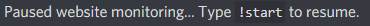
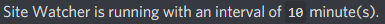

  
  <h3 align="center">site-watcher</h3>
  
A Discord bot that alerts you when (part of) a website changes.

  
  
  

---

## This project is obsolete!

Discord changed the way bots work, and this bot is not working anymore because of that. I won't work on this project anymore so feel free to fork this project and create your own version based on this (and feel free to submit pull requests).

## Features

Notify you in Discord when a website changes:   
   
   
List of features of the site-watcher bot:
- Add multiple sites to watcher
- Remove site from watcher
- Monitoring specified elements of a site, to not get notified on dynamic elements (ex. ads)
- Checking on a specified interval (1-60 minutes, default `5`).
- Manually update tracked sites
- Show list of tracked sites
- Open source!

## Install
Downloading the project:

1. Create a new discord bot on [discord.com/developers/applications](https://discord.com/developers/applications). A tutorial can be found [here](https://discordpy.readthedocs.io/en/latest/discord.html).   
2. Make sure you have [git](https://git-scm.com/downloads) and [nodejs](https://nodejs.org/en/) installed.
3. Clone the repository.
4. Open `cmd.bat` in the repository folder.
5. Type `npm install` and press `enter`.

Configuring the bot:

1. Open the `.env` file.
2. Add your discord bot token after `DISCORDJS_BOT_TOKEN=`. You can get this token from [discord.com/developers/applications](https://discord.com/developers/applications).
3. Add the channel ID from the channel you want the update notifications in after `DISCORDJS_TEXTCHANNEL_ID=`. You can get this ID by right clicking the channel in discord and selecting `Copy ID`.  Make sure `Developer Mode` is on by going to `Settings → Appearance → Advanced → Developer Mode → ON`. Make sure the bot has permission to post in this channel.
4. If you want to change the prefix (default "`!`"), you can change it in the `./src/monitor.js` file (`const PREFIX = '!';`).

For starting and using the bot, see [Usage](#Usage).

## Usage
The simplest method to monitor a site:
1. Invite the bot to your Discord server by replacing `123456789012345678` in the following link with your bot's client id: `https://discord.com/oauth2/authorize?client_id=123456789012345678&scope=bot&permissions=8`. 
1. Open the command line in the cloned repository folder by opening the `cmd.bat` file.
2. Start the bot by typing `npm start`.
3. In Discord (the bot should now be online), add a website with the `!add <URL>` command.
4. Done! The added site is now being monitored.   
By default, the watch interval for every website is 5 minutes, but you can easily change this with the `!interval` command followed by the interval in minutes.

For all other options, see [Commands](#Commands).

## Commands
### `!help`
Show all the available commands.

**Parameters**   
None.

**Example**   
`!help` This will show all the available commands.

**Output**   

---

### `!add <URL> "<CSS SELECTOR>"`
Adds a website to the list.

**Parameters**   
Required:   
`URL` The URL of the site you want to track.   

Optional:   
`"CSS SELECTOR"` The part of the site you want to track. (By default the \<head\> of the site is tracked).   
**Make sure to use double quotation marks when using this parameter.**   
In Chrome, this can be obtained by right clicking the part of the site you want to track and selecting: `Inspect`. After this you see the element highlighted in the developer view. You can right click on the element and select `Copy → Copy selector`. 

**Example**   
`!add https://google.com/` This tracks changes on https://google.com/.   
Note that some sites, including Google.com have dynamic elements (like ads) that cause a change every time its checked. To make sure this is filtered out, use the css selector parameter.   

`!add https://example.com/ "body > div > h1"` This tracks changes in header 1 of the site https://example.com/.

**Output**   

---

### `!remove <NUMBER>`
Removes a website from the list.

**Parameters**   
Required:   
`NUMBER` The number of the site you want to remove. Use `!list` to see the number of the site(s).   

**Example**   
`!remove 1` This removes the first site in the list (`!list`).

**Output**   

---

### `!list`
Shows the list of websites being watched.

**Parameters**   
None.

**Example**   
`!list` This shows the list of websites being watched.

**Output**   

---

### `!update`
Manually updates the sites that are being watched.

**Parameters**   
None.

**Example**   
`!update` This manually updates the sites that are being watched.   
If a site is updated, it will push the standard update message to the default update channel.

**Output**   

---

### `!interval <MINUTES>`
Set the interval/refresh rate of the watcher. Default `5` minutes.

**Parameters**   
`MINUTES` The interval in minutes (minimum of 1, maximum of 60).

**Example**   
`!interval 10` Sets the interval to 10 minutes.

**Output**   

---

### `!start`
Start the watcher with the specified interval (default `ON` with interval of `5` minutes).   
This uses [cron](https://www.npmjs.com/package/cron).

**Parameters**   
None.

**Example**   
`!start` This starts the watcher with the specified interval.

**Output**   

---

### `!stop`
Stops the watcher from automatically checking the tracked websites. Watcher can be resumed with `!start`.

**Parameters**   
None.

**Example**   
`!stop` This stops the watcher from automatically checking the tracked websites.

**Output**   

---

### `!status`
Checks if the site watcher is running.

**Parameters**   
None.

**Example**   
`!status` This checks if the site watcher is running.

**Output**   
When running:   
   
   
When off:   

## Contribute
Im currently not updating the bot with new features, however I'll try to fix bugs that are reported. If you'd like you can add new features or fix bugs by forking the repository and creating a pull request.   
   
Features I want to implement at some point:   
- [ ] Multi-server support   
- [ ] Configuration via Discord, not via config file   
- [ ] Docker image support   
- [ ] More options for setting interval (seconds/hours/days etc.)   

## License
This project is licensed under the MIT License - see the [LICENSE](LICENSE) file for details
